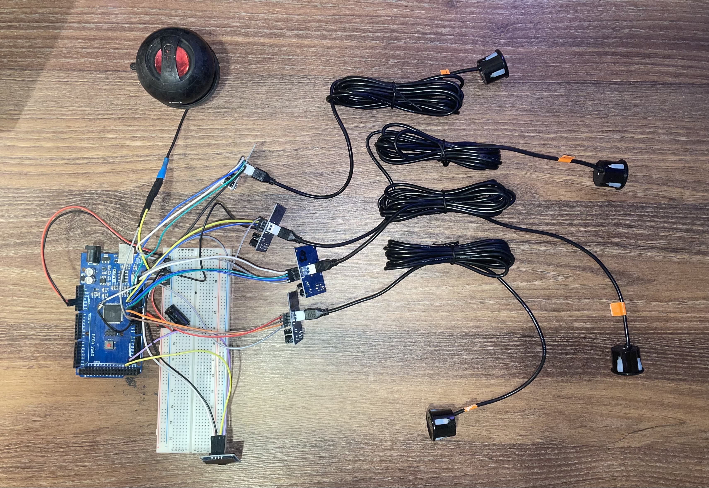

# Arduino Mega Parking Sensor System

A **parking sensor system** built with an **Arduino Mega 2560**, using **JSN-SR04T ultrasonic sensors**, a **0.96” 128×64 OLED display**, and a DIY speaker to alert the driver of nearby obstacles.  

The system monitors front and rear distances, shows measurements on the OLED screen, and produces variable beep tones depending on proximity. A toggle button allows enabling or disabling the system.

---

## Overview

- Detects obstacles in front and behind the vehicle.
- Displays distances on a 128×64 OLED display.
- Produces audio alerts through a DIY speaker.
- Includes a button to enable or disable the system.
- Implements smoothing of sensor readings to reduce noise.
- Note: JSN-SR04T sensors are only reliable for distances **greater than 20 cm**. Distances below 20 cm may be inaccurate.

**Hardware Components:**

- Arduino Mega 2560
- 4× JSN-SR04T Waterproof Ultrasonic Sensors  
  [View Sensors](https://www.temu.com/si-en/1-2-4pcs-jsn-sr04t-integrated-acoustic-technology-module-distance-measurement-sensor-suitable-for--g-601100672110251.html)
- 0.96” 128×64 OLED Display (yellow/white)  
  [View Display](https://www.temu.com/si-en/0-96-inch-oled-display-module--128x64--yellow-white-g-601099658217397.html)
- DIY Speaker (used instead of a piezo buzzer)
- Push Button

**Software / Libraries:**

- Arduino IDE
- [Adafruit BusIO](https://github.com/adafruit/Adafruit_BusIO)  
- [Adafruit GFX Library](https://github.com/adafruit/Adafruit-GFX-Library)  
- [Adafruit SSD1306](https://github.com/adafruit/Adafruit_SSD1306)  
- [SoftwareWire](https://github.com/Testato/SoftwareWire) (optional, for custom I²C pins)

---

## Pin Mapping (Arduino Mega 2560)

| Component | Mega Pin | Notes |
|-----------|----------|-------|
| Push Button | 4 | Wired to GND, uses INPUT_PULLUP |
| DIY Speaker | 5 | Negative wire → GND, positive wires connected together → Pin 5 |
| Front Sensor TRIG | 6 | JSN-SR04T front sensor |
| Front Sensor ECHO | 7 | JSN-SR04T front sensor |
| Rear Left Sensor TRIG | 12 | Rear left sensor |
| Rear Left Sensor ECHO | 13 | Rear left sensor |
| Rear Center Sensor TRIG | 10 | Rear center sensor |
| Rear Center Sensor ECHO | 11 | Rear center sensor |
| Rear Right Sensor TRIG | 8 | Rear right sensor |
| Rear Right Sensor ECHO | 9 | Rear right sensor |
| OLED SDA | 20 | I²C data pin |
| OLED SCL | 21 | I²C clock pin |
| Power (VCC) | 5V | Common 5V rail |
| Ground (GND) | GND | Common ground |

---

## Wiring Diagrams

### Real Hardware Wiring

This picture shows the actual wiring of the Arduino Mega parking sensor system:

### Wokwi Simulation Wiring

This screenshot shows how the project is wired in the Wokwi simulator:

---

## Display Labels (in Slovene)

The OLED shows sensor distances with Slovene labels:

| Label | Meaning |
|-------|---------|
| **Leva** | Left rear sensor |
| **Sredina** | Center rear sensor |
| **Desna** | Right rear sensor |
| **Spredaj** | Front sensor |

- If any sensor detects an object **<20 cm**, the display shows **“STOP”**.  
- For sensors ≥20 cm, the numeric distance is displayed in **cm** next to the label.

---

## How It Works

1. **Button Toggle:** Pressing the button enables or disables the system.  
2. **Sensor Readings:**  
   - 3 rear sensors + 1 front sensor measure distances using JSN-SR04T.  
   - A moving average over 5 readings smooths out noise.  
3. **Display Output:**  
   - Shows “STOP” if an object is very close (<20 cm).  
   - Displays **front sensor distance** if it is the closest.  
   - Otherwise shows distances of **rear sensors** (Left / Center / Right, in Slovene).  
4. **Speaker Alerts:**  
   - Continuous tone if distance <20 cm.  
   - Variable beep interval proportional to distance between 20–99 cm.  
5. **Limitation:** JSN-SR04T sensors are only reliable above 20 cm. Distances under 20 cm may produce inaccurate readings. Better sensors would be recommended for very close distances.

---

## Installation

1. Install the required Arduino libraries via Library Manager:  
   - Adafruit BusIO  
   - Adafruit GFX Library  
   - Adafruit SSD1306  
   - SoftwareWire (optional, only for custom I²C pins)  
2. Connect all components according to the pin mapping.  
3. Open `parking_sensor.ino` in Arduino IDE.  
4. Compile and upload to your **Arduino Mega 2560**.  

---

## Live Simulation (Wokwi)

You can **run and interact with the parking sensor project online** using the Wokwi Arduino Simulator:

👉 [Wokwi Simulation Link](https://wokwi.com/projects/456400726744999937)

**Note:** The simulation uses **HC-SR04 sensors** instead of JSN-SR04T. The behavior is identical for testing purposes.  

- Adjust sensor distance sliders to simulate obstacles in front or behind the vehicle.  
- Watch the OLED display update in real time.  
- The speaker reacts according to proximity, mimicking the real hardware.

---

## Notes / AI Assistance

- Some portions of the code and documentation were assisted by AI tools for guidance and optimization.  
- The final code, wiring, and practical implementation were completed and tested by me on real hardware.

---

## Project Structure

arduino-mega-parking-sensor/
├─ src/
│ └─ parking_sensor.ino # Main Arduino sketch
├─ docs/
│ ├─ parking_sensor.jpg # Photo of the real hardware wiring
│ └─ wokwi_Parking_sensor.jpg # Screenshot of wiring in Wokwi simulation
└─ README.md # Project documentation
